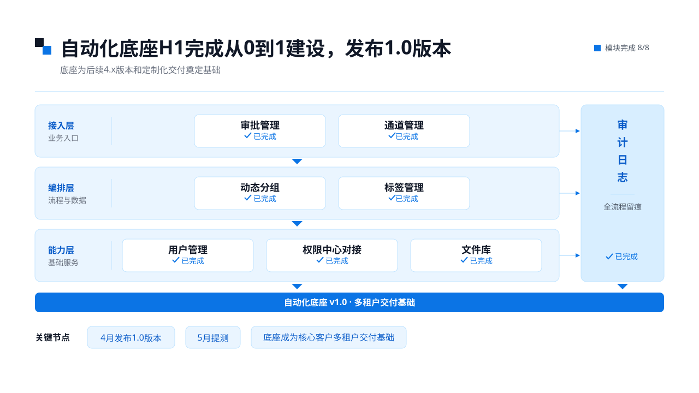
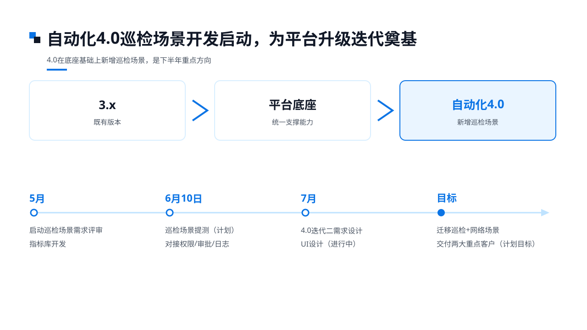
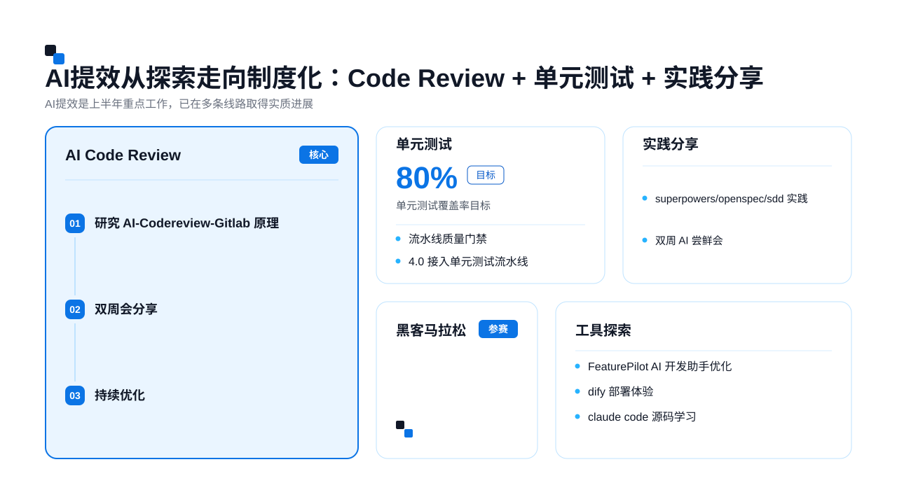
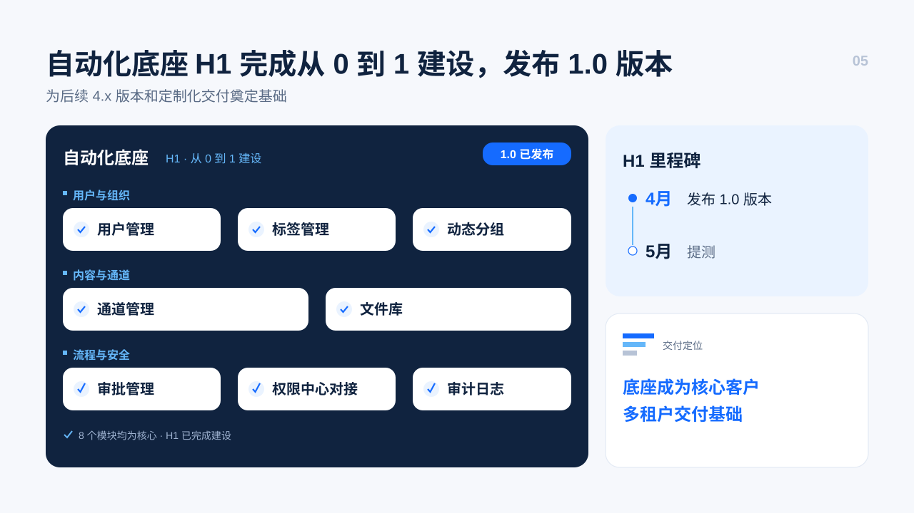
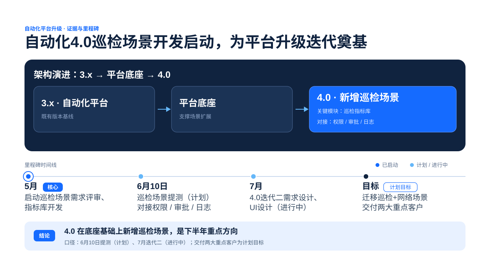

# 📊 PPT Pilot

> 一句话版本：**你说一句话，它给你一套有据可依的幻灯片**——还能一键变成能直接打开的 PPT。🎯

---

## 这是什么？

PPT Pilot 是一个装进 **Claude Code / OpenAI Codex / DeepSeek Harness** 就能用的「幻灯片小助手」。

它做的不是套模板，而是**先帮你把内容捋清楚**：主题是什么、每页讲什么、数字从哪来——全都有据可查；然后再按你选的风格，把它画成好看的 **16:9 SVG 独立页面**。

两个技能，分工明确：

| 技能 | 干什么 |
|---|---|
| `ppt-start` | 从主题 / 资料 / 既有运行，生成有证据支撑的 16:9 独立 SVG 演示 |
| `ppt-editable` | 把一个已完成运行，变成**可编辑、能改字**的原生 PowerPoint |

整个 Skill 本体走**纯指令**路线，不强制依赖 MCP、SDK、Hook、后台服务或运行时软件包；**可选网络**研究默认不启用，机密内容默认不出网。

---

## ✨ 先看效果

下面两套是**同一份已批准的故事板**，分别用两个内置风格包直接编译生成。图片来自真实运行，含客户名称与人名的页面已匿名或未收录。

### 嘉为产品风格 `jiawei-product`

<p align="center">
  
  
  
</p>
<p align="center">
  
  
  
</p>

### 嘉为年中总结风格 `canway-midyear-review`

<p align="center">
  
  
  
</p>
<p align="center">
  
  
  
</p>

> 想自己生成同款？往下看三步就够了。👇

---

## 🚀 三步上手

### 第 1 步：装好技能

技能启动标识：`ppt-start` 和 `ppt-editable`。一键装到三个宿主：

```bash
powershell -ExecutionPolicy Bypass -File tools/update-hosts.ps1
```

它会同时更新 **DeepSeek Harness、Claude Code、Codex**，旧版按 Skill ID 自动备份。想单独更新 DeepSeek，就用 `tools/install-deepseek-plugin.ps1`；复制或**符号链接**的逐宿主命令，见[安装指南](docs/INSTALL.md)。

| 宿主 | 用户级安装 | 项目级安装 | 启动命令 |
|---|---|---|---|
| Claude Code | `~/.claude/skills/ppt-start/` | `.claude/skills/ppt-start/` | `/ppt-start` |
| Codex | `$HOME/.agents/skills/ppt-start/` | `.agents/skills/ppt-start/` | `$ppt-start` |
| DeepSeek Harness | `$HOME/.agents/plugins/plugins/ppt-pilot/` | — | `ppt-start` |

> 小提示：手动安装时，把**完整**的 `skills/ppt-start/` 和 `skills/ppt-editable/` 放进上表路径，别只拷一个文件。🎒

### 第 2 步：只说一句话

```text
/ppt-start
请根据 inputs/ 中的资料制作一份 10 页中文策略演示文稿，使用 guided 模式。
```

执行策略怎么选：**未显式指定策略**时默认 `guided`——它在简报、大纲、锚点页会各问你一次，你点头才继续；`auto` 只有显式说了才用（跳过可选问题但质量门一个不少）。已经做完的运行支持 `resume`（接着跑）和 `revise`（定向改），不用重来；`resume` 会先读 `run.json.manuscript_review.latest_report` 等状态、保留既有执行策略，不重算已批准的上游。

交互上它也很有分寸：先把请求和工作区看一遍，你答过的不重复问，剩下的**一次只**问一个关键问题，给出 2–4 个互斥选项、每项效果和推荐理由——但**推荐不是确认**，提问后一定停住，明确回答才推进下游。

### 第 3 步：拿到文件，还能转 PPT

运行完成后，`slides/` 里就是你的独立 SVG。想要**原生可编辑 PowerPoint**？技能会自动提示下一步，转一下输出到 `delivery/editable/<deck-id>-editable.pptx`。完整的手把手流程见[用户使用手册](docs/USER-GUIDE.md)。

---

## ⚙️ 背后到底发生了什么？

PPT Pilot 的流程很像一位靠谱的同事：**先想清楚，再动手画**。

```text
简报/研究 → 大纲+故事板 → 文稿审查（硬质量门）→ 主题/风格包选择
  → 逐页编译生成（schema-v2 并发批次）→ 单页 QA + 整套 QA → complete
  → （可选）ppt-editable 转原生可编辑 PPTX ／ deck-deliver 组装预览与交付
```

活动视觉路径是**故事板 + `theme.json` 直接编译**：先读所选风格包自带的完整生成模板（`assets/styles/<style-id>/<files.prompt_template>`，没声明就用仓库兜底模板），把已批准的叙事注入它的单一 `{{NARRATIVE}}` 注点，编译出 byte-exact `creative-brief-v1` Prompt，再完成无副作用 preflight 与宿主能力协商。早期那套 `[[CANONICAL_NARRATIVE_BULLETS]]`／`[[STYLE_BASELINE]]` 双 marker 协议，已经作为迁移历史废弃了。

能力协商通过后，以 pointer-last 顺序写 schema-v2 per-slide transactions、batch manifest 和 `run.json.active_visual_generation_batch`，用 `prompt_by_value` 派出 fresh isolated generator，默认 `batch_width: 4`（缺并发或 durable lookup 时降为 width 1，非 Git 不降级）；generator 和每页 validation 可以**并发**，但 candidate/final、visible blocker 与 pointer 只由 coordinator 按 `ordered_slide_ids` **串行**提交——顺序不乱，接得上。

风格通过 `assets/styles/registry.json` 发现，当前内置五个 style pack：`canway-midyear-review`（嘉为年中总结风格，manifest `1.3.0`）、`jiawei-product`、`minimal-business`、`tech-dark`、`bold-editorial`。

> 一条红线：内部 `SRC-<digits>` 只出现在 `data-source-id`／trace 机器元数据里，一旦跑进可见文字，`fact_source_mismatch` 直接硬失败；telemetry 只作诊断，`telemetry_diagnostic_failed` 不改任何正确性结论。🛑

---

## 📁 你会拿到什么？

所有产物都在当前工作区的 `ppt-output/<deck-id>/` 下：

```text
ppt-output/<deck-id>/
├── 大纲.md          # 用户唯一需要亲自查看的内容，含每页排版逻辑
├── slides/          # 最终独立 SVG 页面
└── .ppt-pilot/      # 内部过程产物（用户无需查看）
    ├── run.json
    ├── 简报.md / 研究.md / 来源.md
    ├── 故事板.md / 文稿审查.md
    ├── theme.json / 质量检查报告.md
    ├── generation-prompts/<slide-id>.md
    ├── visual-generation-transactions/<slide-id>-<tx64>.json
    ├── visual-generation-batches/<batch-id>.json
    └── samples/
```

状态以 `.ppt-pilot/run.json` 为准。`resume` 按 `pending_interaction` > `manuscript_review.pending_round` > `visual_generation_blocker` > `run.json.active_visual_generation_batch` > stage scan 的顺序恢复现场。这些文件也是**跨宿主交接接口**：换个宿主，凭这些文件就能接着 `resume`，不用你重讲一遍。

---

## 🛡️ 一个硬规矩：文稿先审，再动手画

`简报.md`、`研究.md`、`来源.md`、`大纲.md`、`故事板.md` 冻结后，**优先**委派全新的独立子 agent（只读审查这五份）；委派启动或归因失败时，就在当前步骤执行正式 `inline_fallback`，报告里必须声明是“**当前上下文降级审查，不具备独立上下文隔离**”。

inline PASS 和独立审查用的是**同一道严格质量门**，都能进 `manuscript_approved`；只要有 `BLOCKER`／`HIGH` 没 `RESOLVED` 就阻断，`OPEN` 与阻断级的 `ACCEPTED_RISK` 也照样拦。subagent 和 inline 轮次都计入每个 cycle 三轮上限，只有冻结输入不可读这类极端情况，才用 legacy 兼容的 `review_unavailable`。

改东西也得按规矩来：`patch` 修一个小缺陷，`recompose` 整页重做；一旦动到事实／来源／大纲／故事板，**必须重新审查**。

---

## 🎁 做完之后怎么交付？

- **只看 SVG / 预览**：直接用 `slides/`，或用 `tools/deck-deliver.ps1` 生成 `preview.html` 联系表、可选 1280×720 PNG 与图片式 PPTX + 演讲者备注；
- **要原生可编辑 PowerPoint**：调用 `ppt-editable`，得到 `delivery/editable/<deck-id>-editable.pptx`——它自带结构/Office/视觉验证，结果状态清晰（`PASS`／`GENERATED_UNVERIFIED`／`BLOCKED`／`FAILED_VERIFICATION`），已验证的旧版**永不被**未验证构建覆盖。

> 说实话，PPT Pilot **不保证**所有 Office 版本都能一致导入，也**不保证**转换后每个元素都**完全可编辑**——但能力到不到位，它都会如实地告诉你，绝不冒充验证通过。🙏

---

## 📚 想深挖？文档在这里

| 文档 | 内容 |
|---|---|
| [用户使用手册](docs/USER-GUIDE.md) | 从发起到拿到可编辑 PPT 的完整操作指引 |
| [安装指南](docs/INSTALL.md) | 逐宿主复制/符号链接、DeepSeek 插件、一键更新 |
| [架构与工作原理](docs/ARCHITECTURE.md) | 编译范式、质量门、并发协议、修订模型 |
| [设计文档](docs/design.md) | 产品原则、共享 Skill 架构、验收标准 |
| [验收台账](docs/acceptance.md) | 证据分级与人工验收记录 |
| [ppt-start 运行时契约](skills/ppt-start/SKILL.md) | 生成技能的入口契约 |
| [ppt-editable 转换契约](skills/ppt-editable/SKILL.md) | 转换技能的入口契约 |

---

## 🧪 想改代码？先跑测试

聚焦命令：

```bash
python -m unittest tests.test_skill_package tests.test_redesign_prompt_contract -v
```

完整命令：

```bash
python -m unittest discover -s tests -v
```

> 提醒一句：自动化测试只证明包结构、书面契约和 fixture oracle，**不能**证明真实宿主行为、浏览器渲染或 PowerPoint 导入；证据分级那些，看[验收文档](docs/acceptance.md)。

---

**PPT Pilot，让做 PPT 回归「想清楚」本身。** 祝你早下班。☕
